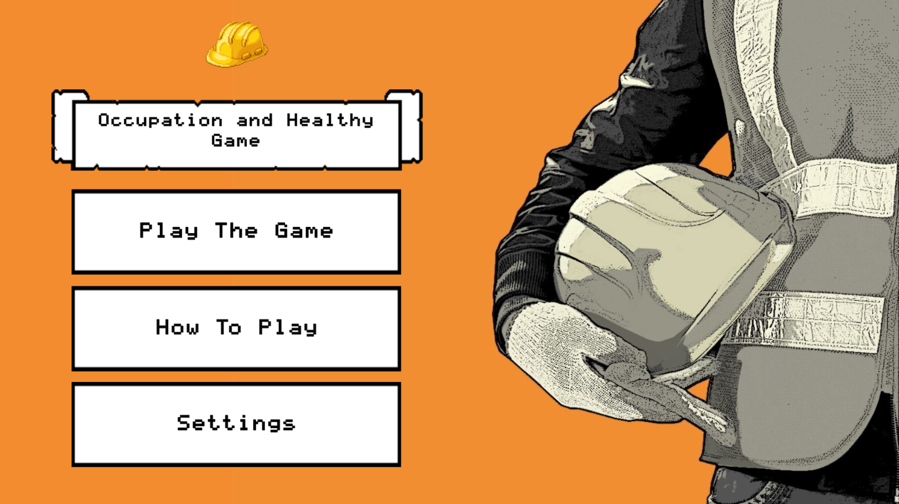
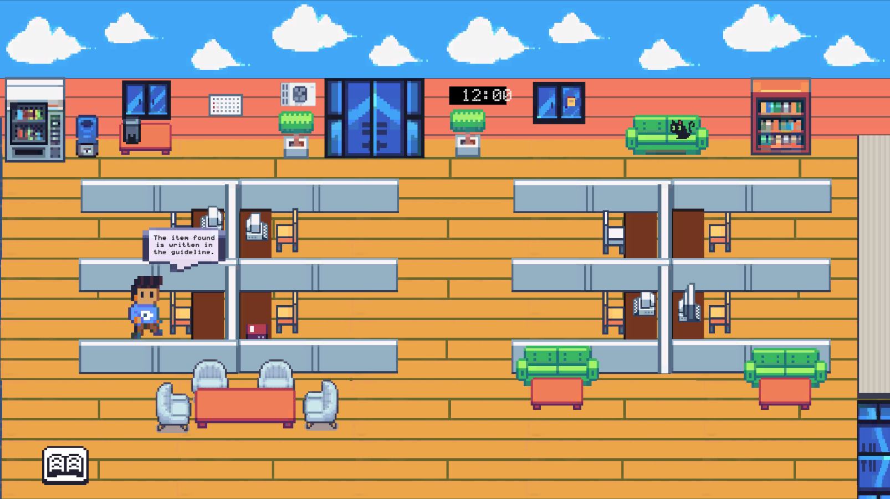
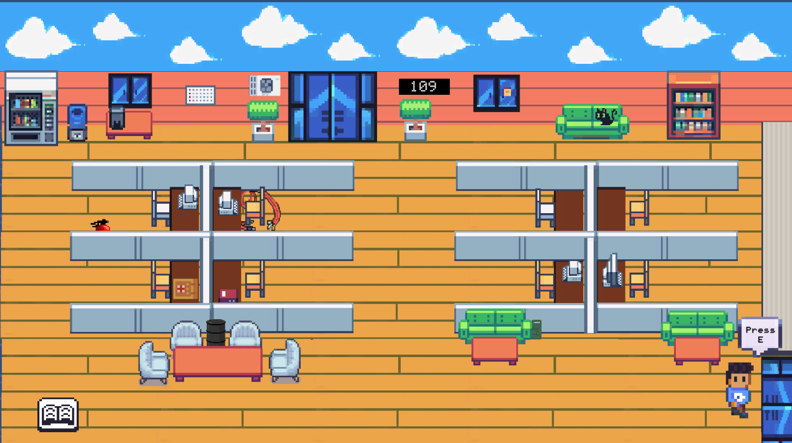
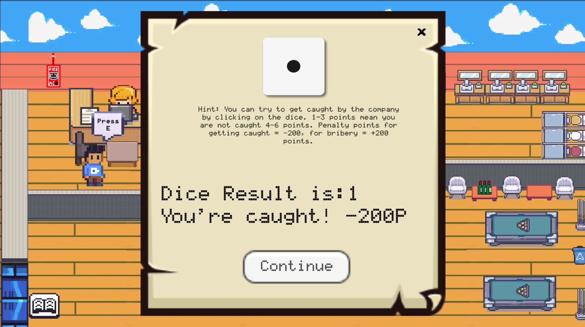

# Occupetional Health and Security Game

It's a 2D missing object game developed in Unity. It contains dialogue and dice mechanics.  
Dice mechanics consist of randomize system. Player aim is to find object that shouldn’t be in an office.

## Showcase
|Style|Image|
|:--:|:--:|
|Item Found | |
|Switch Scene | |
|Bribe Two | |
